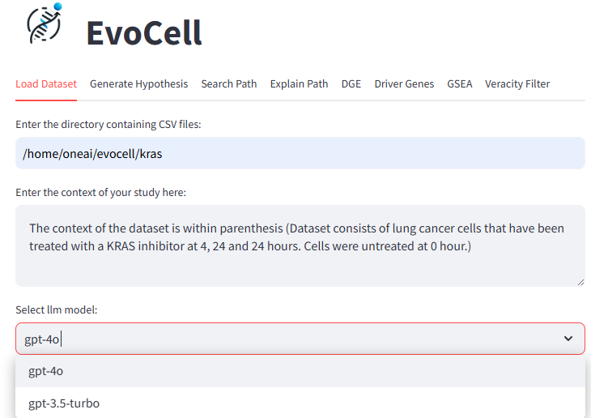
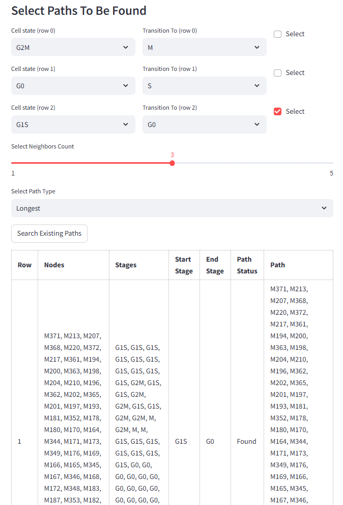
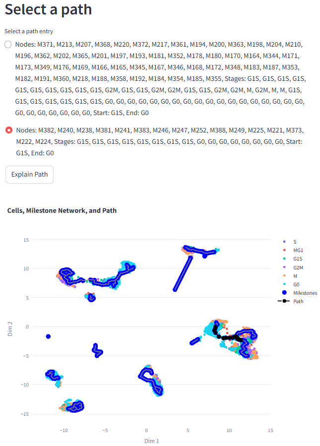
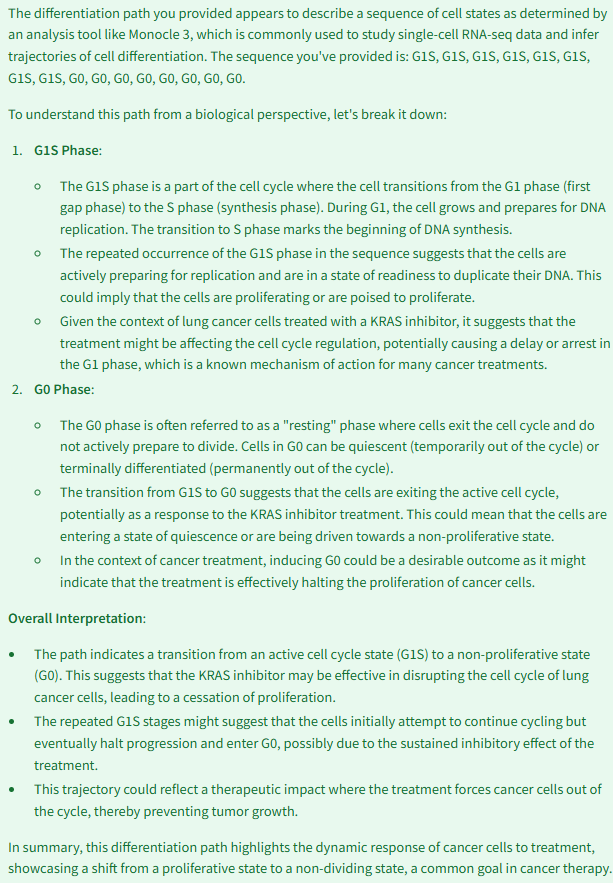
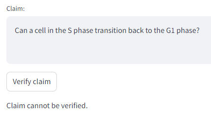
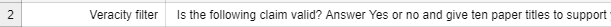
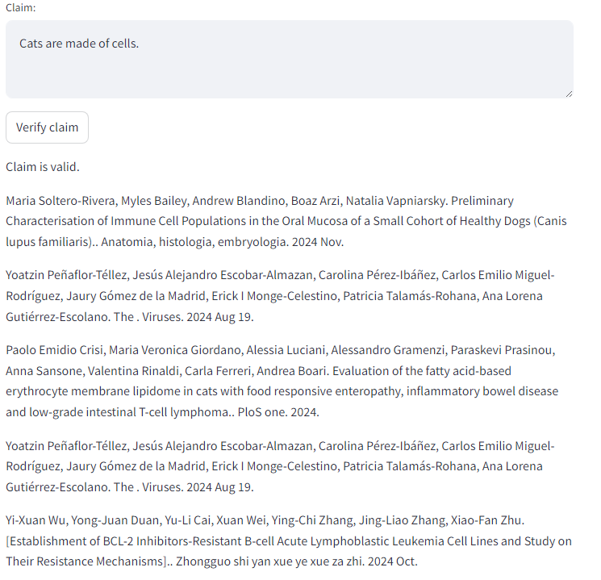

# User Manual for Streamlit EvoCell

## Table of Contents
1. [Introduction](#Introduction)
2. [Using the App](#Using-the-app)
   - 2.1 [Loading Data](#Loading-Data)
   - 2.2 [Generate Hypothesis](#Generate-Hypothesis)
   - 2.3 [Search Path](#Search-Path)
   - 2.4 [Explain Path](#Explain-Path)
   - 2.5 [DGE](#DGE)
   - 2.6 [GSEA](#GSEA)
   - 2.7 [Veracity Filter](#Veracity-Filter)
3. [Customizing the LLM prompts](#Customizing-the-LLM-Prompts)
4. [Adding an LLM](#Adding-an-LLM)

## Introduction
EvoCell is a web-based dashboard to analyze trajectories of single cell RNASeq datasets. Users can use the trajectories obtained from trajectory inference methods such as Monocle3. It allows users to identify cell transitions, automatically generate paths, and conduct downstream analysis such as differential gene expression (DGE) and GSEA. All of the features are augmented with a Large Language Model (LLM) that users can leverage to interpret results and generate insights.

For the processes that take some seconds to run, there is a running indicator on the top right of the page. Please wait until it finishes running before interacting again with the application.

> 

## Using the app

The following titles will guide the users on how to use the Evocell application.

## Loading Data

To begin the analysis, the directory containing the CSV files that will be used for the study. Here is a list of the CSV files. Please refer to the supplementary file for additional details.
 
- Metadata: CSV file that contains column cell_id for the cell identifier 
- Monocle trajectory: The CDS file must be converted to a CSV format which produces progressions.csv, milestone_percentages.csv, dimred_milestone.csv, dimred.csv, and trajectory_edges.csv
- Count Data: A comma delimited count data file (count_data.csv) that has gene names in rows and cell ids as column names. 

The cell identifiers of the count_data.csv and metadata must be identical. Demo Datasets can be found in the data/ folder, where the count_data.csv is gzipped. The users need to unzip this file.

Next, the input context for the study (or it can be left blank). This context will be added to the prompts sent to the LLM every time it is used. For more information, see [Customizing the LLM Prompts](#customizing-the-llm-prompts).

Finally, there is an option to select from the available LLM models. Currently, OpenAI's GPT models and open-source models through Ollama are supported.
- For using the ChatGPT models from OpenAI (4o or 3.5-turbo), ensure that the environment variable `OPENAI_API_KEY` is set up correctly on the machine.
- To use an Ollama model, users must ensure that the Ollama server is running locally. The application will automatically look for the OLLAMA_API_BASE_URL environment variable to establish a connection to the server. If this variable is not set, the application will default to connecting at <http://localhost:11434>.

> 

Once the data has been correctly loaded, an overview of the metadata will be shown, and then the user must select the column that contains the celltype information. **Specifying this celltype column is necessary to use the rest of the features of the app**. There is also the possibility to specify the time column, which will be used in DGE and GSEA in the LLM prompts. 

> 

Lastly, the trajectory plot can be displayed.

> 

## Generate Hypothesis
If the user has correctly selected a celltype column, a message listing the celltypes in the dataset is displayed. The Generate Hypotesis button triggers the LLM to find valid cell state transitions.

> 

### Logic of Hypothesis Generation

- Initially the LLM is prompted to come up with possible cell state transtitions amongst the ones found in the dataset.
- After these cell state transitions are established, for each one transition:
  1. The LLM is prompted again to give 3 papers from PubMed supporting the claim.
  2. The titles are verified against the PubMed API. 
  3. The first paper to be found marks the cellstate transition with *Publication Found*, and the paper metadata is returned.
  4. If there is no paper backing up the cellstate transition claimed by the LLM, the cellstate transition is not validated, but it will still appear in the second table of possible hypothesis.
- Two tables are returned: one for the verified transitions, and another one for all possible transitions.

> 

## Search Path
In search path, the user can search for paths from one cellstate to another. The transitions generated in the Generate Hypothesis tab will appear here, but it is also possible to establish any desired transition. See how in the example below the cellstate G1S transitioning to S is added to the table of available options.

> 

After selecting the transition of interest, the user needs to specify the parameters of the path search:

- **Neighbors count**
  
  It specifies the number of neighboring nodes at both the start and end of a path that should share the same stage as their respective endpoints for the path to be considered valid.

- **Path type: longest or shortest**
  
  It determines whether to keep the longest or shortest version of a path among the valid paths that remain after filtering by the number of neighbors. Shortest paths represent the most direct progression, while longest paths capture additional intermediate stages, offering different *versions* of the trajectory between the same start and end points.
  
The output is a table listing the paths found with their corresponding nodes and stages.

> 

## Explain Path
For this feature of the app to be available the user must have found at least one path in the Search Path tab.

The lists of paths are displayed from which the user has to select one path. Clicking the `Explain Path` button, the trajectory plot containing the path is shown.

> 

The explanation of the path from the LLM is shown below.

To modify the prompt with which the LLM is queried, see [Customizing the LLM Prompts](#customizing-the-llm-prompts).

> 
> *LLM output has been truncated*

## DGE
Differential Gene Expression (DGE) is used to find genes that are statistically over or under expressed between 2 sets of cells within a lineage.

In the trajectory plot, using the Box or the Lasso Select option (box selected by default), the user must make a first selection and click on `Select Baseline Cells`. 

> 
> 

Once as selection is made, the text below the plot is updated to show that baseline cells have been selected. Next, second selection is made and user must click on `Select Comparator Cells` to select the comparator cells. The comparison is Comparator Cells Vs Baseline Cells.

> 

A  message *Both Selections have been made* is displayed, and user can go ahead and click on `Conduct DGE`.
In case there is an overlap, then the comparator cells are stripped off the overlapping cells.  This is a time consuming step and it could take up to 2 minutes depending on the size of the data.

Finally, the table with the differentially expressed genes is displayed and with an option to obtain the LLM explanation.

> 
> 
> *LLM output has been truncated*

To modify the prompt with which the LLM is queried, see [Customizing the LLM Prompts](#customizing-the-llm-prompts).

## GSEA
Functional Analysis (FA) provides biological context to findings from DGE analysis. GeneSet Enrichment Analysis (GSEA) is performed on the DGE results to obtain enriched biological mechanisms. Therefore, before using this feature the DGE analysis must be conducted.

Once DGE has run, the correct Genome and Annotation must be selected, and a table with GSEA results is displayed.

> 

In order to proceed, the user needs to select at least one term from the table (ideally 4-10 terms) to obtain information from through the LLM. After clicking on `Show LLM Explanation`, the LLM output is displayed.

> 

To modify the prompt with which the LLM is queried, see [Customizing the LLM Prompts](#customizing-the-llm-prompts).

## Veracity Filter

In this tab, a user can verify a claim/conjecture related to life sciences and biomedical topics. After entering a claim an clicking the verify button, the LLM checks if the claim is valid. In case the claim is valid, it provides paper titles to support its validity.
- When the LLM states that the claim is valid, and there are papers in PubMed related to the question, the full citation with be displayed for the user. The proposed papers that are not found on PubMed will be filtered out. 
- When the LLM states the claim is not valid, or if it states it is valid but no papers were found on PubMed to back the result, the output is *Claim cannot be verified*.

> 

> 

To modify the prompt with which the LLM is queried, see [Customizing the LLM Prompts](#customizing-the-llm-prompts).

## Customizing the LLM Prompts

All of the prompts can easily be customized by accessing the [prompts file](evocell/app/llm/prompts.csv).

> 

Each identifier maps to a prompt, and the streamlit app queries it on runtime. The prompt can be changed by modifying the prompt entries in the csv file, without needing to restart the app.

Below is an example to change the default behavior of the Veracity Filter to give more than 3 paper titles.

> 

Output of the Veracity Filter that tries to get 10 papers (of which some did not exist on PubMed).

> 

## Adding an LLM

The app currently supports OpenAI and Ollama LLM models. Additional LLM models can be added by modifying the code in [provider.py](evocell/app/llm/provider.py).

Specifically, two functions must be edited:

- [`get_available_models()`](https://github.com/Sanofi-OneAI/oneai-rnd-mdm-scrna_timeseries/tree/evocell_public/evocell/app/llm/provider.py#L10)
  The variable `results` that is returned is the list of strings containing the available models. Extend it to include the LLM of interest. On the first tab in the app, the new LLM will be one of the available options.
  > 

- [`get_llm_output(llm_model, input_string)`](https://github.com/Sanofi-OneAI/oneai-rnd-mdm-scrna_timeseries/tree/evocell_public/evocell/app/llm/provider.py#L42)
  Extend the if else clause to include the new LLM.
  Call the function that interacts with the custom LLM model and assign its output to the `result` variable. Use the `execute_openai_chatgpt` and `execute_ollama_script` functions as reference if needed.
  > 

